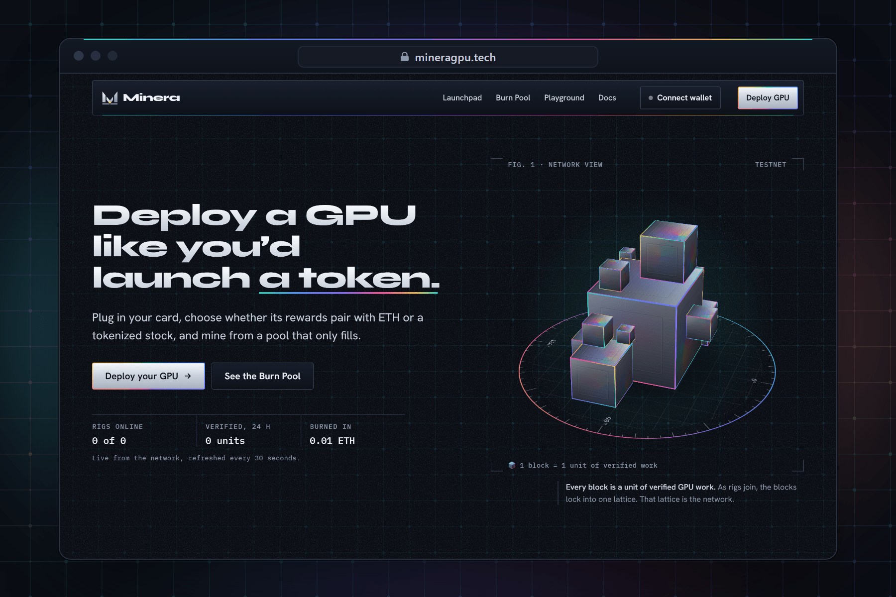
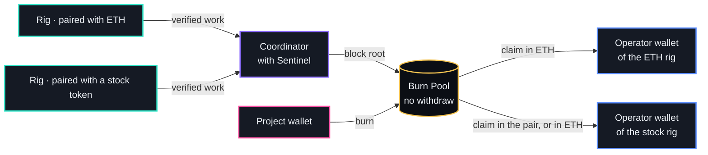
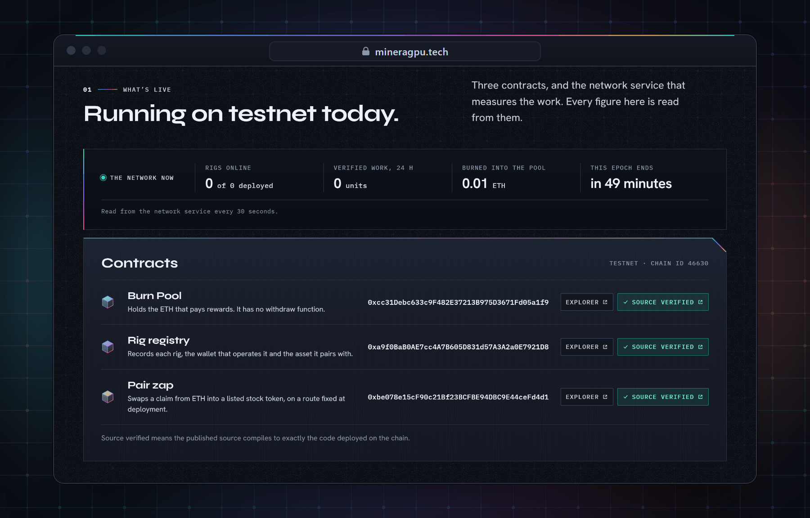

<div align="center">

<a href="https://mineragpu.tech"></a>

# Minera

**Deploy a GPU like you'd launch a token.**

A GPU launchpad for mining. Deploy your card, pair its rewards with ETH or a tokenized stock,<br>
and mine from a pool that only fills.

*Minera means mining.*

<a href="https://github.com/mineragpu/minera/actions/workflows/ci.yml"></a>
<a href="https://github.com/mineragpu/minera/actions/workflows/codeql.yml"></a>
<a href="https://scorecard.dev/viewer/?uri=github.com/mineragpu/minera"></a>
<a href="https://www.bestpractices.dev/projects/15188"></a>
<a href="https://www.npmjs.com/package/@minera-gpu/miner"></a>
<a href="#sentinel"></a>
<a href="#testnet-contracts"></a>
<a href="#testnet-contracts"></a>
<a href="LICENSE"></a>

[Website](https://mineragpu.tech) · [Docs](https://mineragpu.tech/docs) · [Run a node](https://mineragpu.tech/docs/quickstart) · [API](https://mineragpu.tech/docs/api) · [Security policy](SECURITY.md)

</div>

<br>

## Security first

Rigs are paid for work done on machines the network does not control, and their rewards sit in a
contract. Both halves are built to be checked, not trusted: nodes are untrusted about their own
work, every value that determines payment is derived on the server, and the contracts bound what
any key can do with the pool.

> [!NOTE]
> Minera runs on testnet, with test assets. Mainnet is planned. Trust assumptions are published in
> [docs/security.md](docs/security.md).

### Sentinel

Sentinel is the security node that protects mining from bots and scripts. Every rig meets the same
five gates before its work can earn.

```mermaid
flowchart LR
    R["Rig"] --> G1["Identity"] --> G2["Proof of GPU"] --> G3["Canary checks"] --> G4["Cross-check"] --> G5["Reputation"] --> E["Work that earns"]

    classDef endpoint fill:#0F131B,stroke:#8C98AA,stroke-width:1px,color:#EEF2F7
    classDef teal fill:#151A24,stroke:#2EE6C8,stroke-width:2px,color:#EEF2F7
    classDef blue fill:#151A24,stroke:#5A8DFF,stroke-width:2px,color:#EEF2F7
    classDef violet fill:#151A24,stroke:#8C6BFF,stroke-width:2px,color:#EEF2F7
    classDef magenta fill:#151A24,stroke:#FF4FA3,stroke-width:2px,color:#EEF2F7
    classDef gold fill:#151A24,stroke:#F5C451,stroke-width:2px,color:#EEF2F7
    class R,E endpoint
    class G1 teal
    class G2 blue
    class G3 violet
    class G4 magenta
    class G5 gold
```



| Gate | How it works |
|---|---|
| **1.&nbsp;Identity** | Every node request is signed by the rig's node key, bound to one chain, and carries a one-time nonce. Sentinel adds a request budget per key and a cooldown on hello, so a script can neither flood the coordinator nor reset its own checks. |
| **2.&nbsp;Proof&nbsp;of&nbsp;GPU** | The coordinator times every answer itself. A rig must hold a minimum generation speed on the network's model that CPU scripts do not reach. Reported hardware is never trusted, and a rig below the floor gets no open work until it proves its speed again. |
| **3.&nbsp;Canary&nbsp;checks** | Known-answer checks arrive as ordinary chat jobs at random times, drawn from prompts whose answers were settled by rigs of different operators. A rig cannot tell a check from paid work, and a check left unanswered counts as a miss. |
| **4.&nbsp;Cross&#8209;check** | Copies of a job go to rigs that share no operator, no network and no GPU. When two answers disagree, a third rig breaks the tie, and only the rig on the losing side takes a strike, so one bad answer cannot knock an honest rig out. |
| **5.&nbsp;Reputation** | Each rig holds a standing built from its record. New rigs start on probation and earn at half rate until they pass five canaries. Repeated strikes put a rig in quarantine: it gets no work, and its work in that epoch earns nothing. |

Live counts per gate over the last 24 hours are public at
[`https://api.mineragpu.tech/v1/sentinel`](https://api.mineragpu.tech/v1/sentinel), and the
[Sentinel docs](https://mineragpu.tech/docs/sentinel) give every rule and limit.

### On chain

| Guarantee | What the contracts enforce |
|---|---|
| **No&nbsp;withdraw** | Anyone can deposit into the Burn Pool. There is no withdraw, sweep or recovery function and no admin key over funds: deposits leave only through claims against published settlements. |
| **Bounded&nbsp;release** | A block root can never commit more than the pool has received, and each block's release is capped by the daily release limit. |
| **Published&nbsp;inputs** | Every block's inputs and claim table are published, and their digest is on chain, so anyone can recompute every entitlement. |
| **Guardian&nbsp;veto** | A root becomes claimable only after a challenge delay. During it, a guardian can veto a bad root. The guardian can never move funds. |
| **Not&nbsp;upgradeable** | The contracts cannot be upgraded. A change of rules means new contracts at new addresses. |

### Proof

Every claim above can be checked without trusting us.

| Claim | Where to check it |
|---|---|
| **Signed history** | Since October 2026, every commit to `main` is signed with the maintainer's registered key and shows as Verified, and branch protection refuses unsigned pushes. |
| **Parameterized SQL** | Every query is a tagged template whose values travel as bind parameters. [`sqlSafety.test.ts`](https://github.com/mineragpu/minera/blob/main/apps/coordinator/src/db/sqlSafety.test.ts) fails the build if raw SQL appears outside the migration runner, and the [store tests](https://github.com/mineragpu/minera/blob/main/apps/coordinator/src/store/store.test.ts) keep injection-style text as data, in memory and in Postgres. |
| **Validated input** | Every node request is checked against a strict schema in [`routes/node.ts`](https://github.com/mineragpu/minera/blob/main/apps/coordinator/src/routes/node.ts), and the [route tests](https://github.com/mineragpu/minera/blob/main/apps/coordinator/src/routes/node.test.ts) refuse control characters and SQL-like names. |
| **Sentinel holds** | [`sentinel.test.ts`](https://github.com/mineragpu/minera/blob/main/apps/coordinator/src/sentinel/sentinel.test.ts) covers canaries, a poisoned canary bank, tiebreaks, the speed floor and quarantine. |
| **Contracts** | Source-verified on the explorer (see below). Tests cover 100% of lines, statements and branches, with invariant and fuzz runs in CI. The [audit guide](packages/contracts/AUDIT.md) sets out the scope, the roles, the properties that must hold and the behavior already known. |
| **Dependencies** | `npm audit` reports nothing. Actions and base images are pinned by digest and kept current by Dependabot. |
| **Code scanning** | CodeQL's security-extended queries run on every push and weekly. |
| **Independent score** | The [OpenSSF Scorecard](https://scorecard.dev/viewer/?uri=github.com/mineragpu/minera) is computed and published by a workflow on every push. |
| **Best practices** | The project meets every criterion of the [OpenSSF Best Practices passing level](https://www.bestpractices.dev/projects/15188), each with its justification and evidence. |

Found a vulnerability? Report it privately through
[a security advisory](https://github.com/mineragpu/minera/security/advisories/new), not in a public
issue. [SECURITY.md](SECURITY.md) has the scope and response times.

## What it is

| Part | What it does |
|---|---|
| **Deploy** | Register a GPU the way a token gets launched. Name the rig, run one command, and the node detects and benchmarks the card. |
| **Pair&nbsp;with** | Choose the asset your rig's claims default to: ETH, or a tokenized stock listed on the network. The pair zap converts the ETH as you claim, and claiming in ETH always works. The operator can change the pair on the registry. |
| **Mine** | Rigs earn by doing verified GPU work. Wall-clock uptime alone earns nothing. |
| **Burn&nbsp;Pool** | Rewards come from a pool with no withdraw function. What goes in can only leave as mining rewards. |
| **Campaigns** | Rewards are added to the Burn Pool on a regular schedule, through buyback and burn and a distribution of about 10% of creator fees. Each campaign is announced with its schedule. |

## How it works



1. **Deploy.** A rig registers with a signed node key and its chosen pair.
2. **Work.** The coordinator dispatches jobs, cross-checks results and measures verified work per
   rig.
3. **Settle.** Each block, the coordinator publishes a cumulative Merkle root and the full claim
   table. A root becomes claimable only after a challenge delay.
4. **Claim.** The operator wallet claims from the Burn Pool. The claim page defaults to the rigs'
   pair: a stock token is bought with the ETH through the pair zap as the claim is paid. Claiming
   in ETH always works, and the contracts do not enforce the pair.

### Run a node

```sh
npm install --global @minera-gpu/miner
rig init --operator 0xYourWalletAddress
```

Deploy the rig from that wallet on the [Deploy page](https://mineragpu.tech/deploy), then run
`rig start --coordinator https://api.mineragpu.tech`. The [quickstart](https://mineragpu.tech/docs/quickstart)
covers the requirements: a GPU, its driver, a local model runtime and Node.js 22 or later.

## Testnet contracts



Deployed on the testnet (chain ID 46630) and verified with an exact source match.

| Contract | Address |
|---|---|
| Burn Pool | [`0xcc31Debc633c9F482E37213B975D3671Fd05a1f9`](https://explorer.testnet.chain.robinhood.com/address/0xcc31Debc633c9F482E37213B975D3671Fd05a1f9) |
| Rig registry | [`0xa9f0BaB0AE7cc4A7B605D831d57A3A2a0E7921D8`](https://explorer.testnet.chain.robinhood.com/address/0xa9f0BaB0AE7cc4A7B605D831d57A3A2a0E7921D8) |
| Pair zap | [`0xbe078e15cF90c21Bf23BCFBE94DBC9E44ceFd4d1`](https://explorer.testnet.chain.robinhood.com/address/0xbe078e15cF90c21Bf23BCFBE94DBC9E44ceFd4d1) |

| Parameter | Testnet value |
|---|---|
| Challenge delay before a settlement is claimable | 30 minutes |
| Share of the uncommitted pool releasable per day | 10% |
| Publisher rotation delay | 1 hour |
| Delay before a new pair or zap can be used | 10 minutes / 30 minutes |

Roles, functions, events and errors are listed in [Contracts](https://mineragpu.tech/docs/contracts).

## Status

| Phase | Scope | State |
|---|---|---|
| 0&nbsp;·&nbsp;Identity | Brand, design system, site | In progress |
| 1&nbsp;·&nbsp;Testnet | Coordinator, node client, deploy flow, launchpad board, Burn Pool and rig registry on testnet | In progress: contracts live |
| 2&nbsp;·&nbsp;Mainnet | Contracts on mainnet, the first burn, Campaign 01, claims in the rigs' pair or in ETH | Planned |

## Repository

```
apps/
  web/            site and app: launchpad, deploy, rig pages, Burn Pool, campaigns, docs
  coordinator/    API, Sentinel, verification, block settlement, chain indexer
packages/
  shared/         brand, chain config, mining math, merkle, shared types
  miner/          the node client
  contracts/      Burn Pool, rig registry, pair swaps
docs/             documentation, rendered by the site
ops/              deployment configuration
.github/          CI, code scanning, dependency updates, issue and pull request forms
```

<details>
<summary><b>Build and test locally</b></summary>

<br>

Requires Node.js 24 (see `.nvmrc`) and, for the contracts, Foundry.

```sh
npm ci
npm run typecheck
npm test -w @minera/shared -w @minera/coordinator -w @minera-gpu/miner
npm run build -w @minera/web

cd packages/contracts
forge soldeer install
forge test
```

Set `TEST_DATABASE_URL` to also run the coordinator's store tests against Postgres.
[CONTRIBUTING.md](CONTRIBUTING.md) covers the full setup, the commit format and pull requests.

</details>

## Documentation

| Start | Mining | Reference | Trust |
|---|---|---|---|
| [Overview](https://mineragpu.tech/docs/overview) | [Pairs and claims](https://mineragpu.tech/docs/pairs-and-claims) | [Contracts](https://mineragpu.tech/docs/contracts) | [Sentinel](https://mineragpu.tech/docs/sentinel) |
| [Quickstart: run a node](https://mineragpu.tech/docs/quickstart) | [Verification and rewards](https://mineragpu.tech/docs/verification-and-rewards) | [Coordinator API](https://mineragpu.tech/docs/api) | [Security and trust](https://mineragpu.tech/docs/security) |
| [Deploy a rig](https://mineragpu.tech/docs/deploy-a-rig) | [Burn Pool](https://mineragpu.tech/docs/burn-pool) | [Node protocol](https://mineragpu.tech/docs/node-protocol) | [FAQ](https://mineragpu.tech/docs/faq) |
| | [Campaigns](https://mineragpu.tech/docs/campaigns) | | [Glossary](https://mineragpu.tech/docs/glossary) |

The coordinator API is served at `https://api.mineragpu.tech`. The same pages are in [`docs/`](docs).

## Contributing

Issues and pull requests are welcome. Read [CONTRIBUTING.md](CONTRIBUTING.md) first, and follow the
[code of conduct](CODE_OF_CONDUCT.md). Security issues go through [SECURITY.md](SECURITY.md).

## License

Licensed under the [Apache License, Version 2.0](LICENSE).
