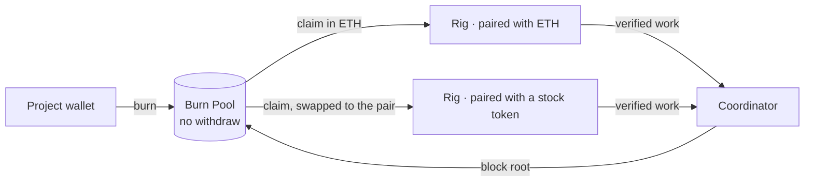

<div align="center">

# DayaGPU

**Deploy a GPU like you'd launch a token.**

A GPU launchpad for mining. Deploy your card, pair its rewards with ETH or a tokenized stock,
and mine from a pool that only fills.

*Daya means power.*

</div>

---

## What it is

| | |
|---|---|
| **Deploy** | Register a GPU the way a token gets launched. Name the rig, run one command, and the node detects and benchmarks the card. |
| **Pair with** | Choose the asset your rig is paid in: ETH, or a tokenized stock listed on the network. You can change the pair for the next block. |
| **Mine** | Rigs earn by doing verified GPU work. Wall-clock uptime alone earns nothing. |
| **Burn Pool** | Rewards come from a pool with no withdraw function. What goes in can only leave as mining rewards. |
| **Campaigns** | Each campaign announces the share that is burned into the pool, and when. |

## How it works



1. **Deploy.** A rig registers with a signed node key and its chosen pair.
2. **Work.** The coordinator dispatches jobs, cross-checks results and measures verified work per
   rig.
3. **Settle.** Each block, the coordinator publishes a cumulative Merkle root and the full claim
   table. A root becomes claimable only after a challenge delay.
4. **Claim.** A miner claims from the Burn Pool. ETH is paid directly. Any other pair is swapped
   on the way out and delivered in that asset.

## The Burn Pool

- **One-way.** Anyone can deposit. There is no withdraw, sweep or recovery function, and the
  contract cannot be upgraded.
- **Bounded.** A block root can never commit more than the pool has received, and each block's
  release is capped by the active campaign.
- **Checkable.** Every block's inputs and claim table are published, so anyone can recompute every
  entitlement.
- **Guarded.** During the challenge delay a guardian can veto a bad root. The guardian can never
  move funds.

## Repository

```
apps/
  web/            site and app: launchpad, deploy, rig pages, Burn Pool, campaigns, docs
  coordinator/    API, verification, block settlement, chain indexer
packages/
  shared/         brand, chain config, mining math, merkle, shared types
  miner/          the node client
  sdk/            typed API client
  contracts/      Burn Pool, rig registry, pair swaps
docs/             documentation
marketing/        brand files, posters, videos, captions
ops/              deployment configuration
```

## Status

| Phase | Scope | State |
|---|---|---|
| 0 · Identity | Brand, design system, site | In progress |
| 1 · Testnet | Coordinator, node client, deploy flow, launchpad board, Burn Pool and rig registry on testnet | Planned |
| 2 · Mainnet | Contracts on mainnet, the first burn, Campaign 01, claims in ETH or a tokenized stock | Planned |

## Security

- The pool contract holds no admin key over funds. Deposits leave only through verified claims.
- Nodes are untrusted about their own work. Every value that determines payment is derived
  server-side.
- Known limitations and trust assumptions are published in the docs as each part ships.

Report a vulnerability privately to **security@dayagpu.com**.
